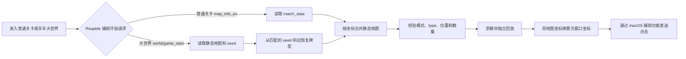

# 羊了个羊地图解析、求解与自动点击

这是一个 macOS 本地工具，用于从 Reqable 捕获的微信小游戏响应中还原《羊了个羊》普通关卡和羊羊大世界地图，按地图 `type` 和遮挡关系计算无道具消除顺序，并通过辅助功能在微信窗口发送鼠标点击。

项目在本机运行。Reqable 负责记录游戏请求；脚本通过 Reqable 自带的本地 MCP 服务读取记录，不需要把抓包文件复制到项目。求解依据数字 `type`、坐标和地图机制配置，牌名只用于日志显示。

地图类型自动识别为三类：**普通局、大世界普通局、闪电飞碟局**。普通局与大世界普通局按开始接口区分；存在有效 `goldBlockData` 收集配置时识别为闪电飞碟局，同时保留原接口模式，用于选择牌名和窗口坐标配置。

## 版本与验证状态

- 项目版本：开发版，尚未发布语义版本号或正式 release tag。
- 游戏服务路由版本：`/sheep/v1/...`；具体字段按抓到的响应校验，客户端/服务端不一定遵循独立的语义版本号。
- Reqable MCP 初始化协议：`2024-11-05`。
- Python：3.10 或更新版本；原生窗口助手使用当前 macOS SDK 编译。
- 牌型名称：普通关卡和大世界使用独立中文名称表；未登记的 type 显示“类型N”。名称不参与求解。
- 自动点击：点击位置由地图坐标和固定窗口布局计算。程序不会从屏幕识别牌面或读取真实槽位，也不会确认游戏的胜利弹窗。
- 协议事实与样本统计于 2026-10-08 核对。游戏服务端和 Reqable 版本更新后，接口行为可能变化。

## 功能流程



完整运行命令是 `python run`。脚本执行前需要 Reqable 已开始抓包，微信小游戏已进入目标模式的初始地图，槽位为空。大世界在 `need_seed=true` 时还需要同一 Reqable 会话中存在可验证的历史结算响应；若证据不足，程序停止而不猜测牌型。

## 安装环境

### 系统要求

- macOS 和微信桌面版中的目标小游戏窗口。
- Reqable for macOS，且安装包包含 `Contents/Helpers/mcp-server`。
- Python 3.10 或更新版本。
- Xcode Command Line Tools，提供 `swiftc` 和 `clang++` 编译窗口助手及逆向求解器。
- 为启动脚本的终端应用或 Codex 授予 macOS 辅助功能权限。

### 安装步骤

在项目根目录执行：

```sh
python3 -m venv .venv
.venv/bin/python -m pip install -r scripts/requirements-click.txt
```

Reqable 本地 MCP 服务的默认路径写在 `scripts/map_capture.py`：

```text
/Applications/Reqable.app/Contents/Helpers/mcp-server
```

Python 运行依赖为 `lzstring==1.0.4` 和 `networkx==3.4.2`，分别用于解压和地区导航路径搜索。protobuf wire-format 解析、坐标处理和 Reqable MCP 客户端使用 Python 标准库。窗口点击助手由 `scripts/game_window.swift` 编译，逆向求解器由 `scripts/solve_map_native.cpp` 编译；运行时会在需要且二进制不存在或源码更新时自动编译，不需要安装 OR-Tools。

如果当前终端没有 `python` 命令，可使用 `python3 run`。也可以在 zsh 中配置 `alias python=python3`。

### macOS 权限

在“系统设置 → 隐私与安全 → 辅助功能”中允许启动进程控制电脑：

- 从终端启动时，允许 Terminal、iTerm 等实际启动脚本的终端。
- 从 Codex 启动时，允许 Codex。

`scripts/game_window capture` 是可选的窗口截图命令，单独使用时需要屏幕录制权限；主流程不调用截图命令。

## 快速开始

1. 打开 Reqable，确认正在捕获流量。
2. 在微信打开《羊了个羊：星球》，进入普通关卡或羊羊大世界初始地图，不要先点击牌。
3. 在项目根目录执行：

   ```sh
   python run
   ```

4. 程序读取当前捕获的地图、计算解法并输出预检信息，然后倒数 3 秒开始点击。

运行中不要手动操作游戏或移动鼠标。移动鼠标超过 3 个屏幕逻辑单位、按 Ctrl-C 或进程遇到错误时，程序会停止。已发生点击的局面应从对应 `runs/` 记录继续，不能重新运行一局初始地图方案。

## 大世界地区导航

地区地图导航与消除关卡是两个入口。保持 Reqable 捕获，并进入显示地区坐标与岛屿的大世界页面，在项目目录运行：

```sh
# 输入游戏顶部展示的目标坐标；目标不必在当前视野内
python run --navigate 12565 6486

# 只查看方向、无障碍最少步数和下一跳，不点击
python run --navigate 12565 6486 --dry-run
```

导航每次只点击当前回包中已知的普通相邻地块，并合并附近礼物动态状态，避开未领取奖励、正在挑战和状态未知的地块。等待服务端确认、客户端动画与新周边状态后重新规划，点击前再次核对。支持斜向移动；无障碍最少步数为 `max(abs(dx), abs(dy))`。未知区域可能存在障碍，不能预先保证可达或给出全程准确步数。

默认最多移动 200 步，可用 `--max-steps N` 调整。鼠标移动、Ctrl-C、连接变化、窗口变化、回包目标不一致或超时都会停止，不会盲目重复点击。运行记录保存到 `runs/navigate-*/`。不自动处理事件、挑战或传送，当前点击布局限定为客户端版本 500 对应的等比例 350x665 窗口。

地区导航的协议、限制及验证范围见[地区导航文档](docs/research/world-navigation.md)。不带 `--navigate` 的 `python run` 仍执行原来的消除关卡流程。

## 命令行参数

根目录 `run` 默认开启实际点击。消除关卡的底层脚本为 `scripts/play_game.py`；包含 `--navigate` 时改用 `scripts/world_navigation.py`，导航可用 `--dry-run` 禁止点击。下表为消除关卡参数。

| 参数 | 默认值 | 含义 |
| --- | --- | --- |
| `--help` | | 显示参数帮助，不执行棋盘点击 |
| `--execute` | 根目录入口自动添加 | `scripts/play_game.py` 的实际点击开关；直接调用底层脚本时不指定则只预检 |
| `--resume PATH` | 无 | 从本机已有运行目录读取地图、解法和进度继续 |
| `--window-id ID` | 自动选择唯一窗口 | 同时检测到多个游戏窗口时，指定目标窗口 ID |
| `--max-clicks N` | `500` | 本次最多发送多少次点击；小于剩余牌数时运行后暂停 |
| `--seconds N` | `180` | 求解器运行时间上限 |
| `--delay SEC` | `0.5` | 点击后的固定等待时间，最小 `0.3` 秒 |

示例：

```sh
# 完整流程：捕获、求解、点击
python run

# 只预检，不点击
scripts/run_game.command

# 最多点击 4 张牌
python run --max-clicks 4

# 接续一次已保存且状态明确的运行
python run --resume runs/your-run-id

# 调整点击间隔
python run --delay 0.4
```

直接调用底层脚本时，默认只预检：

```sh
.venv/bin/python scripts/play_game.py
.venv/bin/python scripts/play_game.py --execute --max-clicks 4
```

## 服务接口

本项目涉及两类接口：游戏服务端的只读 HTTP 响应，以及 Reqable 暴露给本机进程的 MCP 工具。自动点击通过 macOS 鼠标事件发送，不使用游戏动作 HTTP 接口。

### 游戏地图接口

| 用途 | 当前地址 | 使用方式 |
| --- | --- | --- |
| 普通关卡初始化 | `https://cat-match.easygame2021.com/sheep/v1/game/map_info_ex` | 从 Reqable 历史记录读取；`matchType=3`，优先使用 `match_data` |
| 大世界初始化 | `https://cat-match.easygame2021.com/sheep/v1/game/world/game_start` | 从 Reqable 历史记录读取；`matchType=6`，读取 `map_seed_2` 和静态地图标识 |
| 大世界牌型数据 | `https://cat-match.easygame2021.com/sheep/v1/game/map_info_ex_seed` | 从 Reqable 历史记录读取本局 seed 响应；按同会话、同加密版本的结算记录验证后本地恢复牌型 |
| 获取静态地图文件 | `https://cat-match-static.easygame2021.com/maps/{map_md5}.map` | 优先从 Reqable 记录读取；未捕获时用 Python `urllib` 发起 GET |

当前解析器按主机和 URL 路径筛选两种模式的开始请求、seed 请求及结算记录，再从响应内容解出数据；解析器不会把完整请求 URL、请求头或会话 token 写入运行报告。请求方法由客户端当前实现决定，代码没有用 HTTP 方法作筛选条件。

初始化响应按 JSON 读取，使用字段如下：

| JSON 字段 | 含义与校验 |
| --- | --- |
| `err_code` | 必须为 `0`，否则视为游戏接口失败 |
| `data.map_md5` | 当前两种模式均要求两项；下标 `1` 指目标关卡静态地图标识 |
| `data.match_data` | 普通关卡可能提供 LZ-string UTF-16 压缩的 JSON 字符串；为空时走该模式的 seed 分支，不复用旧地图 |
| `data.map_seed_2`、`data.need_seed` | 大世界 seed 标识及是否需要读取 seed 响应 |

响应的结构示意如下。值用占位符表示，不应把 Reqable 中的完整 URL、请求头或账号凭据复制到公开文档：

```json
{
  "err_code": 0,
  "data": {
    "map_md5": ["<level-1-map-md5>", "<level-2-map-md5>"],
    "match_data": "<lz-string-utf16-compressed-json>"
  }
}
```

若响应包含 `match_data`，解压后当前要求恰好包含两个关卡状态，程序选择下标 `1`，并要求该状态的 `gameType` 与开始请求匹配（普通关卡为 `3`，大世界为 `6`），且：

- `fullSync == true`。
- `gameState.crushedBlockCount`、`crushAreaBlocks`、`moveOutAreaBlocks` 显示棋盘尚未操作。
- `gameState.allBlockRuntimeData` 中每张牌都能和静态地图节点匹配。

解压过程使用 LZ-string UTF-16 模式：每个压缩字符先取 `ord(character) - 32` 作为压缩单元，再由 `lzstring` 解码并交给 JSON parser。解析器只使用响应中的结构化数据，不解析或保存完整请求参数。

第二关状态的关键结构示意：

```json
{
  "crushMapInfo": {"gameType": 3},
  "fullSync": true,
  "gameState": {
    "crushedBlockCount": 0,
    "crushAreaBlocks": [],
    "moveOutAreaBlocks": [],
    "allBlockRuntimeData": [
      {
        "type": 11,
        "layerNum": 3,
        "colNum": 4,
        "rowNum": 52,
        "blockId": 123,
        "moldType": 1,
        "metaType": 0,
        "metaData": 0,
        "AreaType": 0
      }
    ]
  }
}
```

上述数字仅作字段格式示意，不代表固定牌或固定坐标。

运行时牌记录的关键字段：

| 字段 | 含义 |
| --- | --- |
| `type` | 牌型数字 ID；求解和三消匹配的依据 |
| `layerNum` | 所在层数 |
| `colNum` | 横向坐标，对应静态地图节点的 `rolNum` |
| `rowNum` | 纵向坐标，对应静态地图节点的 `rowNum` |
| `blockId` | 当前响应中的运行时牌编号，写入合并地图的 `cardId` |
| `moldType` | 牌堆或节点结构属性；与静态地图逐节点核对 |
| `metaType`、`metaData` | 特殊牌属性；当前求解器拒绝非零 `metaType` |
| `AreaType` | 牌所在区域；当前求解器只接受棋盘区域 `0` |

静态 `.map` 文件包含 `.map` 文件头及 protobuf 内容。当前解析器检查文件头、跳过前 21 字节，再解析剩余的 protobuf wire format。常用地图字段如下：

| 地图字段 | 用途 |
| --- | --- |
| `widthNum`、`heightNum` | 地图网格尺寸 |
| `levelKey` | 地图/关卡标识 |
| `blockTypeData` | 类型 ID 到“三张一组”数量的映射 |
| `levelData` | 分层节点；包含 `id`、`rolNum`、`rowNum`、`layerNum`、`moldType` |
| `layers` | 排序后的层号列表 |

当前解析器使用的静态 protobuf 字段编号：

| protobuf 消息 | 字段号 | 解析为 |
| --- | ---: | --- |
| `GameMap` | 1 | `widthNum` |
| `GameMap` | 2 | `heightNum` |
| `GameMap` | 3 | `levelKey` |
| `GameMap` | 4 | 重复的类型计数字典项；字典项子字段 1 为 type，子字段 2 为组数 |
| `GameMap` | 5 | 重复的层数据；层消息子字段 1 为层号、子字段 2 为节点列表 |
| 节点消息 | 1 | 节点 ID |
| 节点消息 | 2 | `type`；静态文件缺省时解析成 `0` |
| 节点消息 | 3 | `rolNum` |
| 节点消息 | 4 | `rowNum` |
| 节点消息 | 5 | `layerNum` |
| 节点消息 | 6 | `moldType` |

protobuf 字段语义应以当前本机代码和匹配的客户端协议为准；未知字段保留为 wire-format 字段，不据此猜测业务含义。

静态地图通常没有具体 `type`。普通关卡使用运行时 `match_data` 提供的牌型和 `blockId`，按 `layerNum-colNum-rowNum` 与静态节点合并。大世界若初始化响应没有 `match_data`，则读取本局 `/map_info_ex_seed` 请求及响应；当前实现以同会话、相同 `encryptKeyVersion` 的历史结算记录验证并恢复 seed 响应，再按静态地图和 seed 生成每张牌的 type。两种路径都会核对地图类型数量；运行时合并还会核对节点集合与 `moldType`。

`type=17` 显示为“闪电”，仍可按相同类型三张消除。静态节点中固定的闪电保留其位置和类型，不消耗 seed 洗牌序列；只有 `type=0` 节点从洗牌后的牌池取值。`blockTypeData` 是随机牌池的组数，其中也可以包含闪电；最终计数为各类型组数乘以 3，再加上固定闪电数量。固定闪电数量必须能被 3 整除，未定型节点数必须与随机牌池大小一致。未知预设类型仍会停止，不会一律改成普通牌。

静态 `.map` 的 protobuf 字段 6 是 `goldBlockData`：`collectCount` 是飞碟触发阈值，`blockList[0].val` 是收集牌型。当前支持收集类型为 17 的配置，不能仅凭出现 type 17 就判断飞碟会触发。初始运行时的 `metaType=3, metaData=4` 只在匹配该配置的闪电牌上接受；变色牌、其他特殊属性以及已进行中的棋盘不支持。飞碟局即使有 `match_data`，也必须获得可验证的 seed，核对牌型和编号，并保存初始洗牌结束后的随机数状态。

### Reqable MCP 本地接口

`scripts/map_capture.py` 启动 Reqable 自带的 MCP server 子进程，并通过 stdin/stdout 使用行分隔 JSON-RPC。初始化协议版本为 `2024-11-05`，随后调用：

| MCP 工具 | 输入 | 用途 |
| --- | --- | --- |
| `capture_live_filter` | `filters` | 按主机和路径筛选普通关卡、大世界开始、seed 与结算记录；静态地图查找按完整 URL 筛选 |
| `capture_live_get_by_id` | `id` | 读取匹配记录的响应状态、编码和响应体 |

调用参数形状示意：

```json
{
  "name": "capture_live_filter",
  "arguments": {
    "filters": [
      {"type": "host", "hosts": ["cat-match.easygame2021.com"]},
      {"type": "keyword", "pattern": "/map_info_ex"}
    ]
  }
}
```

筛选返回记录 ID 后，客户端逐个调用 `capture_live_get_by_id` 并检查 URL 的 path 必须精确等于 `/sheep/v1/game/map_info_ex`。静态地图查找筛选完整的 `https://cat-match-static.easygame2021.com/maps/{map_md5}.map` URL。

响应体支持 Reqable 提供的 `base64` 和 `utf8` 两种编码。MCP 调用单次等待上限为 15 秒；失败、空响应、HTTP 非 200、无法识别的编码和空 `match_data` 都会终止本次流程。

Reqable MCP 与上述游戏 HTTP 接口不是同一个接口：前者是本机程序化读取抓包历史的工具服务，后者是微信小游戏访问的游戏服务端。

### 不会调用的接口

当前自动流程不会向 `/logic_server/v1` 等动作接口提交游戏操作，也不会调用游戏内道具接口。点击是通过 `scripts/game_window.swift` 对指定微信窗口发送鼠标事件完成的。seed 请求由微信客户端发出，脚本只读取 Reqable 捕获记录并在本地验证、恢复，不会另行向 seed 接口发送请求。静态地图在 Reqable 中未捕获时，程序只对公开地图文件 URL 发起 GET。

## 地图数据和牌型

牌面 ID 使用服务端的数字 `type`，不是从 PNG 或截图推测出来的。类型名称仅用于显示：

| `type` | 显示名称 | `type` | 显示名称 | `type` | 显示名称 |
| ---: | --- | ---: | --- | ---: | --- |
| 1 | 草 | 6 | 白菜 | 11 | 水桶 |
| 2 | 胡萝卜 | 7 | 羊毛 | 12 | 手套 |
| 3 | 玉米 | 8 | 刷子 | 13 | 铃铛 |
| 4 | 树桩 | 9 | 剪刀 | 14 | 篝火 |
| 5 | 叉子（耙子） | 10 | 奶瓶 | 15 | 粉红线团 |

普通关卡的牌型名称由 `scripts/map_capture.py` 的 `NAMES` 映射，羊羊大世界由独立的 `WORLD_NAMES` 映射。`MODE_NAMES` 按当前模式选择名称表，两张表分别维护，不互相回退。未知 type 保留“类型N”，不会沿用旧名称。续跑时根据已保存地图的模式重新加载名称，数字 type 和点击顺序保持不变。

样本数量、名称核验和实机结果见文末“验证快照”，不代表后续地图的固定数量或通关保证。

## 求解规则和算法

求解器位于 `scripts/solve_map.py`。输入地图必须有 `levelData`，且每张牌都包含唯一 ID、正整数 `type`、整数坐标与层数。程序拒绝重复 ID/位置、非棋盘区域、非零特殊牌类型、每类总数不能被 3 整除的地图，以及超过 500 张牌的输入。

### 遮挡判断

- 每张牌占据 `8 × 8` 个地图逻辑单位。
- 牌被任意更高层、且横纵坐标差都严格小于 8 的剩余牌遮挡。
- 横向或纵向距离恰好为 8 时不算遮挡。
- 遮挡会检查所有更高层，不只相邻层。

### 槽位和消除

- 槽位最多容纳 7 张牌。
- 每次选择一张当前可点击的牌，将其 `type` 加入槽位。
- 同 `type` 牌会在槽位逻辑中归组；同一 `type` 达到 3 张时立即消除。
- 第 7 张牌只有在这一步触发三消、消除后槽位少于 7 张时才合法。
- 成功条件是棋盘和槽位同时清空。

普通局和大世界普通局先尝试最多 2 秒的正向深度优先搜索，再在剩余时间内最多并发运行四个原生逆向束搜索，从全部消除的终局倒推合法顺序。各实例使用不同搜索宽度和随机种子；首个通过完整回放校验的结果会被采用，其余进程随即停止。求解不依赖牌名或截图。

搜索只负责找候选顺序；`replay()` 再以显式剩余牌集合和槽位列表独立检查每步遮挡、重复点击、槽位容量、三消和终局。没有通过回放的顺序不会进入实际点击。`timeout` 表示达到时间上限，`search_exhausted` 表示裁剪后的候选用尽，两者均不能证明地图无解。

### 闪电飞碟局

初始闪电带 4 点有效能量。点击仍有能量的闪电会增加收集数；每次点击后，其余原本可点的闪电能量减 1，新露出的闪电不在这次衰减范围内。能量耗尽不改变牌的数字 type。达到地图配置阈值后，先处理三消，再触发一次飞碟。

飞碟将槽位牌与棋盘上对应牌型补成三张一起移除；槽位为空时随机选一组三张。选择使用本局洗牌后继续推进的随机数序列，按层、行、列枚举剩余牌。飞碟还会清除剩余牌的能量属性。

程序先求出普通三消候选路径，模拟能量衰减直到飞碟触发，再删除飞碟选中的棋盘和槽位牌、重新求解剩余棋盘。两段求解共用时间预算，最终整条路线重新进行机制回放；后半段求解失败时不发送任何点击。飞碟未触发时保留完整普通三消路径。

点击执行到飞碟触发步骤时，保存 `pendingUfo` 并暂停点击 30 秒，随后重新核对当前局再继续。等待期间鼠标移动或中断会停止，并保留 `inFlight=true`，不能盲目续跑。30 秒是保守的动画等待时间，不是客户端完成确认；飞碟移除结果和槽位仍为规则推算。旧版闪电局计划缺少机制数据，拒绝 `--resume`，需重新进入初始棋盘。

## 点击坐标与执行模型

当前窗口布局基准为 350 × 665 macOS 逻辑像素。地图中的横向 `rolNum` / `colNum` 和纵向 `rowNum` 经固定布局比例转换，再加上微信游戏窗口左上角坐标：

```text
scale_x = window_width / 350
scale_y = window_height / 665
screen_x = window_origin_x + (50 + 4.5 × colNum) × scale_x
screen_y = window_origin_y + (146 + 4.5 × rowNum) × scale_y
```

窗口横纵缩放比例相差超过 0.02 时，程序停止。窗口需保持前台，目标位置不能被其他窗口遮挡。原生助手会检查窗口 ID、进程、边界、前台状态和辅助功能权限，再发送鼠标移动、按下和松开事件；按下持续 70 毫秒。

程序每步在日志中打印“已点击牌名”和按解法预先推算的“当前槽位”，例如：

```text
已点击【草】；当前槽位（推算）【草、胡萝卜】（26/243）
```

该槽位是根据地图 `type` 和求解步骤计算的预期值，不是游戏画面的实时读取值。程序也不会确认点击是否真的被游戏接收，`nextStep` 表示已发送并记入记录的点击次数，不等同于服务端确认。

## 本地运行文件

每次运行在 `runs/<record-id>-<timestamp>/` 创建独立目录，通常包含：

| 文件 | 内容 |
| --- | --- |
| `map.json` | 本次合并后的完整棋盘和来源标识 |
| `solution.json` | 求解状态、点击顺序、逐步槽位变化和回放结果 |
| `coordinate-model.json` | 本次窗口坐标缩放与偏移 |
| `preflight.json` | 地图来源、窗口、步数和执行模式 |
| `progress.json` | 下一步序号、点击是否处理中、运行状态 |

`progress.json` 的 `inFlight=true` 表示在点击事件前已经写入“点击处理中”，但尚未写入该步完成状态。若程序恰在此阶段退出，不能盲目恢复；先人工核对当前游戏画面和运行状态，再决定处理方式。`sequence_completed` 只表示计划中的点击都已发送，不代表游戏确认通关；`winScreenConfirmed` 当前始终为 `false`。

运行 JSON 的主要字段：

| 文件 | 字段 | 含义 |
| --- | --- | --- |
| `map.json` | `levelData` | 每层牌节点列表；节点包含位置、`type`、`cardId` 和结构属性 |
| `map.json` | `_source` | Reqable 的 `recordId`、`recordUid`、捕获时间和静态地图 MD5；不包含 URL query/header |
| `solution.json` | `status` | `solved` 表示搜索到解，且该解通过独立回放 |
| `solution.json` | `operations` | 按顺序排列的节点 ID |
| `solution.json` | `steps[]` | 每步的节点 ID、`cardId`、type、位置、前后槽位及是否消除 |
| `solution.json` | `verified`、`triples` | 回放验证结果和计划中的三消次数 |
| `preflight.json` | `coordinateModel` | 当前窗口使用的坐标缩放与偏移 |
| `preflight.json` | `clickingEnabled` | 本次是否允许发送鼠标事件 |
| `progress.json` | `nextStep` | 已写入进度的点击事件数量 |
| `progress.json` | `inFlight` | 是否停在一次尚未写入完成状态的点击中 |
| `progress.json` | `status` | `prepared`、`running`、`paused`、`stopped` 或 `sequence_completed` |

运行数据可能含 Reqable 记录 ID、UID、地图和点击进度，因此 `.gitignore` 排除了 `captures/`、`decoded/`、`runs/` 和 `.venv/`。不要把带请求头的原始抓包、完整 URL 查询参数、会话凭据、微信用户加密密钥或 IV 提交到公开仓库。

## 错误与停止行为

| 情况 | 处理方式 |
| --- | --- |
| Reqable 没有当前模式的开始记录，或模式与 `matchType` 不匹配 | 停止；重新开始抓包并进入目标模式，不使用旧记录代替 |
| 大世界 seed 请求缺失或找不到可验证的同会话、同加密版本结算记录 | 停止；保留 Reqable 记录并补齐证据，不猜测牌型 |
| `match_data` 格式错误或解压失败 | 终止当前运行 |
| 地图数量、坐标、结构或类型计数不一致 | 终止当前运行，不点击 |
| 地图运行时状态显示已有点击/消除 | 拒绝作为新局求解输入 |
| 找不到唯一的游戏窗口 | 停止；可用 `--window-id` 选择窗口 |
| 游戏窗口位置、尺寸、焦点或覆盖状态不满足要求 | 点击前停止 |
| 用户移动鼠标超过阈值 | 停止，保留进度文件 |
| Reqable MCP 单次请求超过 15 秒 | 报超时并停止 |
| 求解器到达 `--seconds` 时限 | 报 `timeout` 并停止，不发送点击；可提高时限或改进求解算法 |
| 束搜索裁剪后候选耗尽 | 报 `search_exhausted` 并停止，不把局部步骤当作完整解执行 |

要恢复只能指定对应的本机运行目录：

```sh
python run --resume runs/your-run-id
```

仅在同一局仍处于脚本预期状态、且没有额外手动点击时恢复。不要用旧运行目录去操作新地图。

## 深入文档

- [文档索引](docs/README.md)：按使用指南、研究记录、历史分析和地图样本分类浏览。
- [地图求解与点击](docs/guides/click-pipeline.md)：点击前置条件、进度文件和坐标模型。
- [求解器规则](docs/guides/solver.md)：输入契约、遮挡规则、搜索与验证。
- [地图字段分析](docs/research/map-field-analysis.md)：逐牌类型与静态地图的来源及核验要求。
- [2026-10-08 样本记录](docs/samples/2026-10-08/82136-new-game-verification.md)：固定地图快照，仅用于参考。

## 项目结构

```text
.
├── README.md
├── run                         # 单命令完整流程入口
├── docs/
│   ├── README.md               # 文档索引
│   ├── guides/                 # 当前点击与求解说明
│   ├── research/               # 字段分析及历史研究
│   └── samples/                # 固定日期地图样本，不可用于新局
├── experiments/legacy/         # 不属于当前主流程的实验脚本
├── scripts/
│   ├── play_game.py            # 流程编排、坐标和运行记录
│   ├── map_capture.py          # Reqable MCP、响应解码、双模式地图解析
│   ├── seed_map.py             # 大世界 seed 校验和牌型生成
│   ├── analyze_captures.py     # 静态 .map 与 protobuf wire-format 解析
│   ├── solve_map.py            # 搜索、独立回放和求解器 CLI
│   ├── reverse_search.py       # 原生求解器编译与调用
│   ├── solve_map_native.cpp    # 有时间和宽度上限的逆向束搜索
│   ├── game_window.swift       # macOS 窗口检查和鼠标事件
│   ├── run_game.command        # 预检/底层入口
│   └── requirements-click.txt  # Python 运行依赖
├── tests/
│   ├── test_solve_map.py       # 求解器边界测试
│   └── test_map_capture.py     # 双模式、seed 和捕获记录校验
├── captures/                   # 本机 Reqable 输入，Git 忽略
├── decoded/                    # 本机解码数据，Git 忽略
└── runs/                       # 本机每次运行输出，Git 忽略
```

## 开发与验证

运行默认测试套件：

```sh
python3 -m unittest discover -s tests -v
```

独立处理本机 `captures/` 下的 Reqable 响应与 `.map` 文件：

```sh
.venv/bin/python scripts/analyze_captures.py
```

分析器只递归解析 protobuf wire format 并生成本机 `decoded/capture_report.json`；原始响应本身应留在本机，不应直接推送到仓库。

## 项目边界

- 支持输入：普通局、大世界普通局和闪电飞碟局的初始地图捕获与牌型恢复；初始槽位为空，不手动使用道具。飞碟自动移除由专用规则模拟。
- 不支持：变色等其他动态牌、非棋盘区域牌、局中手动操作、洗牌/撤回/移出及广告复活后的状态恢复。
- 大世界 seed 恢复依赖可验证的 Reqable 历史结算样本；大地图可能在默认求解时限内无法得到解。解析成功不代表求解或点击一定成功。
- 不处理微信登录、进入小游戏、点击关卡入口、广告或胜利弹窗。
- 不调用游戏动作接口，不保证客户端/服务端会接受每个鼠标事件。
- 游戏接口可能调整。出现空响应、格式变化或类型校验失败时，应先检查当前 Reqable 记录与接口结构，不应移除校验后继续点击。

## 附录：验证快照

2026-10-08 核验：普通关卡历史样本有 243 张牌、23 层、15 种 type，四份历史地图均通过完整解回放；当天日常已经完成，本次修改未重做日常实机通关。大世界样本有 255 张牌、26 层、15 种 type、43 张初始可点牌，约 18 秒得到完整解，实际点击完成后，结算请求为 `rank_state=1`、`removed=255`，响应 `err_code=0` 且 `game_over_resp.win=true`。

该大世界样本中核对到的 type 与图案对应关系，与上方名称表一致；这不是跨模式或跨版本永远相同的保证，因此两种模式仍分别配置名称。验证时人工检查画面，正式捕获、求解和点击流程不依赖截图识别。

2026-10-10：闪电飞碟样本的前 145 次点击与客户端上报一致，飞碟触发时刻及已捕获的移除 ID 前缀通过规则复现。243 张牌的样本完成包含飞碟移除和剩余棋盘求解的离线回放；用户随后确认新版成功实机通关，该次成功对局的结算响应未另行核验。详见[飞碟样本核验](docs/samples/2026-10-10/lightning-ufo.md)。
